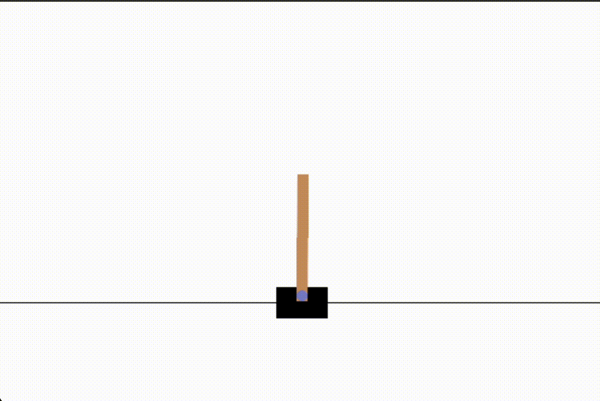
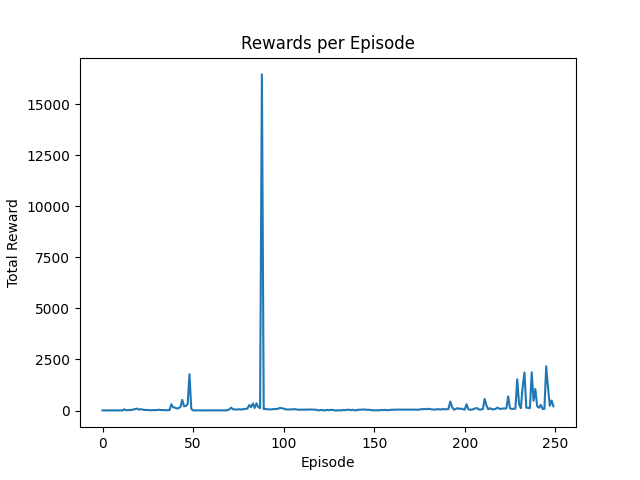
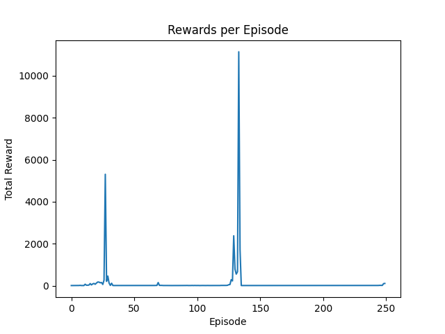

# CartPole Reinforcement Learning Project

## Overview
This project implements a Deep Q-Learning (DQL) algorithm to train an agent to play the CartPole game from OpenAI Gym. The DQL agent learns to play the game by interacting with the environment and improving its strategy over time.

CartPole is a simulation in Gymnasium where the objective is to balance a pole on a cart. The agent controls the cart with two possible actions: pushing left or right. The environment is described with four observations: cart position and velocity, and pole angle and angular velocity. The challenge is to keep the pole balanced by applying the correct forces, as episodes end if the pole tilts over ±12 degrees or the cart moves out of ±2.4 units from the center. Success is measured by the duration the pole remains upright, with a reward of +1 for every step maintained.

## File Structure
- `Model.py`: Contains the neural network model for the DQL agent.
- `DeepQLearning.py`: Contains the main logic for the Deep Q-Learning algorithm.
- `main.py`: The driver script that sets up the environment and starts the training process.


## Dependencies
To run this project, you need the following dependencies:
- Python 3.x
- PyTorch
- OpenAI Gym
- Numpy
- PyGame
- Matplotlib (for plotting the performance upon completion)

To install these dependencies, run the following command:
```
pip install -r requirements.txt
```
## How to Run
1. Ensure you have all the necessary dependencies installed.
2. Run the `main.py` script:

   ```
   python main.py
   ```

## Execution


## Performance Report

The training process and performance of the Deep Q-Learning (DQL) agent are tracked through the rewards accumulated per episode. The graph depicted below illustrates the agent's progression throughout the training episodes.




### Observations

- **General Trend**: The rewards graph indicates a generally flat trend across the majority of the episodes, which suggests the agent has not significantly improved its strategy throughout the training period.
- **Sporadic Spikes**: There are occasional and significant spikes in rewards. These may indicate episodes where the agent either explored a successful sequence of actions or benefited from specific state-action pairs that led to high rewards.
- **Post-Spike Performance**: After the spikes, the rewards drop back to the baseline, which could imply that the agent has not fully learned or integrated the successful actions into its policy.

### Potential Factors for Flat Trend

- **Insufficient Exploration**: The agent might not be exploring enough due to a quickly decaying epsilon or a lack of incentivizing rewards for exploration.
- **Suboptimal Learning Rate**: The chosen learning rate might be too low, leading to slow updates, or too high, causing the agent to overshoot optimal policies.
- **Experience Replay Buffer**: The experiences stored might lack diversity or are not replayed effectively, preventing the agent from learning from a representative sample of the state space.
- **Reward Signal Issues**: The reward structure may not be granular enough to provide meaningful feedback to the agent for slight improvements in its actions.

### Analysis of Anomalous Spikes

- **Random Chance**: Given the randomness in action selection and experience replay, some spikes might result from fortunate sequences that are not replicated in subsequent episodes.
- **Policy Improvement**: Occasional spikes may represent brief moments where the agent's policy aligns well with the optimal strategy, leading to higher rewards.

### Conclusions

The flat trend observed for the majority of episodes suggests that the DQL agent is not effectively learning or improving its strategy. This could be due to several reasons, ranging from the choice of hyperparameters and reward signals to the complexity of the action space and the limitations of the algorithm.

### Actionable Steps for Improvement

- **Hyperparameter Optimization**: Conduct a thorough search for the optimal set of hyperparameters, including learning rate, epsilon decay, and batch size.
- **Enhanced Exploration Techniques**: Implement strategies to encourage more exploration, such as entropy bonuses or Noisy Nets.
- **Network Architecture**: Experiment with different neural network architectures to improve the agent's ability to generalize from its experiences.
- **Reward Function Refinement**: Refine the reward function to ensure that it provides a clear gradient for the agent to learn more effectively.